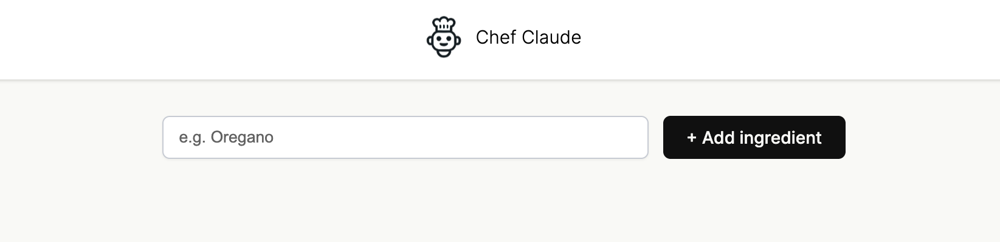

# Chef Claude
Chef Claude is a dynamic web app that takes ingredients from the user and generates recipes - powered by the ClaudeAPI. 
This website will soon be hosted on jparrtech.com
 
 ## Professional Growth:
 * Built controlled forms to capture and manage user input
 * Changed and updated state within components
 * Used the useState React hook to manage component state. 
 * Learned how to communicate state across components (passing state as props).
 * Learned how to render content dynamically based on user specific criteria (conditional rendering).
 

